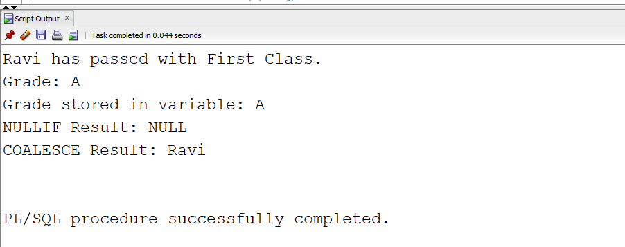

# EXPERIMENT-6A)

## PL/SQL Code for an Algorithm
```

SET SERVEROUTPUT ON;

DECLARE
    -- Declare variables
    v_student_name  VARCHAR2(50);
    v_marks         NUMBER;
    v_grade         VARCHAR2(10);
    v_test1         NUMBER;
    v_test2         NUMBER;
    v_nullif_result NUMBER;
    v_coalesce_result VARCHAR2(50);

BEGIN
    -- Assign sample values
    v_student_name := 'Ravi';
    v_marks := 85;
    v_test1 := 100;
    v_test2 := 100;

    -- Nested IF statement
    IF v_marks >= 40 THEN
        IF v_marks >= 60 THEN
            DBMS_OUTPUT.PUT_LINE(
                v_student_name || ' has passed with First Class.'
            );
        ELSE
            DBMS_OUTPUT.PUT_LINE(
                v_student_name || ' has passed with Second Class.'
            );
        END IF;
    ELSE
        DBMS_OUTPUT.PUT_LINE(
            v_student_name || ' has failed.'
        );
    END IF;

    -- CASE Statement
    CASE
        WHEN v_marks >= 90 THEN
            DBMS_OUTPUT.PUT_LINE('Grade: A+');
        WHEN v_marks >= 80 THEN
            DBMS_OUTPUT.PUT_LINE('Grade: A');
        WHEN v_marks >= 70 THEN
            DBMS_OUTPUT.PUT_LINE('Grade: B');
        WHEN v_marks >= 60 THEN
            DBMS_OUTPUT.PUT_LINE('Grade: C');
        WHEN v_marks >= 50 THEN
            DBMS_OUTPUT.PUT_LINE('Grade: D');
        WHEN v_marks >= 40 THEN
            DBMS_OUTPUT.PUT_LINE('Grade: E');
        ELSE
            DBMS_OUTPUT.PUT_LINE('Grade: F');
    END CASE;

    -- CASE Expression to assign grade to variable
    v_grade :=
        CASE
            WHEN v_marks >= 90 THEN 'A+'
            WHEN v_marks >= 80 THEN 'A'
            WHEN v_marks >= 70 THEN 'B'
            WHEN v_marks >= 60 THEN 'C'
            WHEN v_marks >= 50 THEN 'D'
            WHEN v_marks >= 40 THEN 'E'
            ELSE 'F'
        END;

    -- Display grade stored in variable
    DBMS_OUTPUT.PUT_LINE(
        'Grade stored in variable: ' || v_grade
    );

    -- NULLIF function
    v_nullif_result := NULLIF(v_test1, v_test2);

    IF v_nullif_result IS NULL THEN
        DBMS_OUTPUT.PUT_LINE(
            'NULLIF Result: NULL'
        );
    ELSE
        DBMS_OUTPUT.PUT_LINE(
            'NULLIF Result: ' || v_nullif_result
        );
    END IF;

    -- COALESCE function
    v_coalesce_result :=
        COALESCE(NULL, NULL, v_student_name, 'No Name');

    -- Display COALESCE result
    DBMS_OUTPUT.PUT_LINE(
        'COALESCE Result: ' || v_coalesce_result
    );

EXCEPTION
    WHEN OTHERS THEN
        DBMS_OUTPUT.PUT_LINE(
            'Error: ' || SQLERRM
        );
END;

```
## Output of the PL/SQL code



