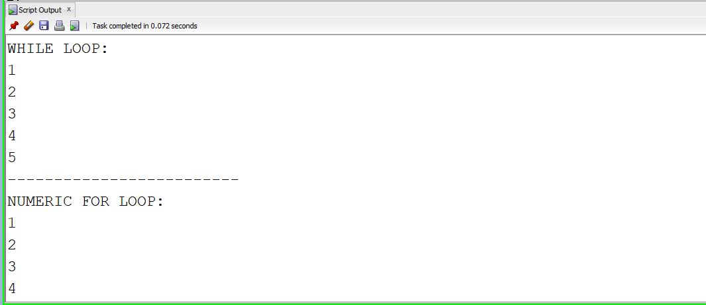
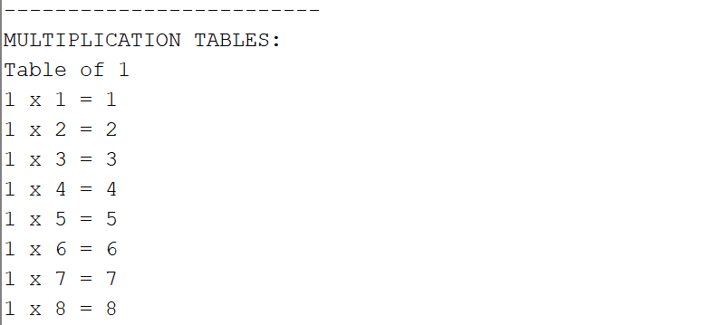
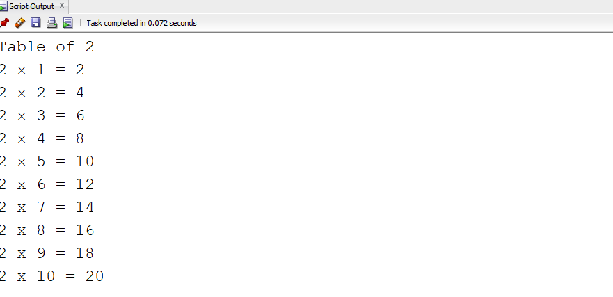
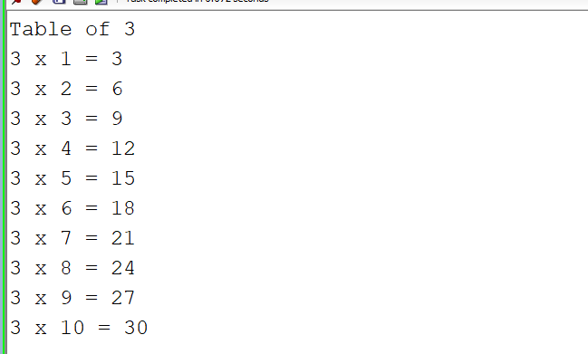
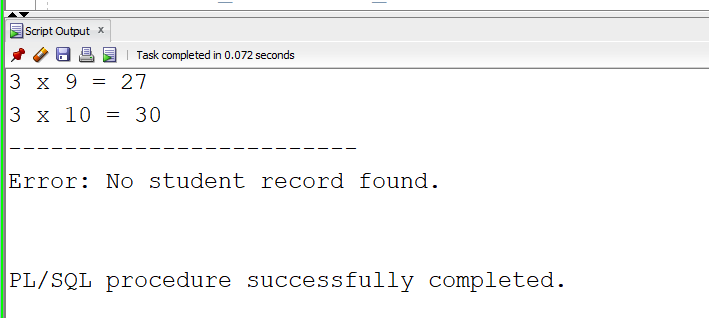

# Experiment - 6b
## Pl/SQl Code 

```

SET SERVEROUTPUT ON;

DECLARE
    -- Declare required variables
    v_student_id    student.student_id%TYPE;
    v_student_name  student.student_name%TYPE;
    v_marks         student.marks%TYPE;
    v_age           NUMBER;

    -- User-defined exception
    e_invalid_marks EXCEPTION;

BEGIN
    -- 1. WHILE LOOP: Display numbers from 1 to 5
    DBMS_OUTPUT.PUT_LINE('WHILE LOOP:');

    v_student_id := 1;

    WHILE v_student_id <= 5
    LOOP
        DBMS_OUTPUT.PUT_LINE(v_student_id);
        v_student_id := v_student_id + 1;
    END LOOP;


    -- 2. NUMERIC FOR LOOP: Display numbers from 1 to 5
    DBMS_OUTPUT.PUT_LINE('-------------------------');
    DBMS_OUTPUT.PUT_LINE('NUMERIC FOR LOOP:');

    FOR i IN 1..5
    LOOP
        DBMS_OUTPUT.PUT_LINE(i);
    END LOOP;


    -- 3. NESTED FOR LOOP: Multiplication tables from 1 to 3
    DBMS_OUTPUT.PUT_LINE('-------------------------');
    DBMS_OUTPUT.PUT_LINE('MULTIPLICATION TABLES:');

    FOR i IN 1..3
    LOOP
        DBMS_OUTPUT.PUT_LINE('Table of ' || i);

        FOR j IN 1..10
        LOOP
            DBMS_OUTPUT.PUT_LINE(
                i || ' x ' || j || ' = ' || (i * j)
            );
        END LOOP;

        DBMS_OUTPUT.PUT_LINE('-------------------------');
    END LOOP;


    -- 4. Retrieve student record using SELECT INTO
    SELECT student_id, student_name, marks
    INTO v_student_id, v_student_name, v_marks
    FROM student
    WHERE student_id = 101;

    -- Display retrieved student details
    DBMS_OUTPUT.PUT_LINE('STUDENT DETAILS:');
    DBMS_OUTPUT.PUT_LINE(
        'Student ID   : ' || v_student_id
    );
    DBMS_OUTPUT.PUT_LINE(
        'Student Name : ' || v_student_name
    );
    DBMS_OUTPUT.PUT_LINE(
        'Marks        : ' || v_marks
    );


    -- 5. Validate student's marks
    IF v_marks > 100 THEN
        RAISE e_invalid_marks;
    ELSE
        DBMS_OUTPUT.PUT_LINE(
            'Marks are valid.'
        );
    END IF;


    -- 6. Validate student's age
    v_age := 17;

    IF v_age < 18 THEN
        RAISE_APPLICATION_ERROR(
            -20001,
            'Student age must be 18 or above.'
        );
    ELSE
        DBMS_OUTPUT.PUT_LINE(
            'Student age is valid.'
        );
    END IF;


EXCEPTION

    -- Handle NO_DATA_FOUND exception
    WHEN NO_DATA_FOUND THEN
        DBMS_OUTPUT.PUT_LINE(
            'Error: No student record found.'
        );

    -- Handle user-defined exception
    WHEN e_invalid_marks THEN
        DBMS_OUTPUT.PUT_LINE(
            'Error: Student marks cannot be greater than 100.'
        );

    -- Handle other exceptions
    WHEN OTHERS THEN
        DBMS_OUTPUT.PUT_LINE(
            'Error: ' || SQLERRM
        );

END;

```
## Output



---


---


---


---


---
