# EXPERIMENT 7a)

## 1. Create Table and Insert Sample Records
> **Note: if table already exit drop it and create it.**

```
SET SERVEROUTPUT ON;

CREATE TABLE student (
    st
udent_id NUMBER(5) PRIMARY KEY,
    student_name VARCHAR2(50),
    course VARCHAR2(30),
    marks NUMBER(5,2)
);

INSERT INTO student VALUES (101, 'Ravi', 'CSE', 85);
INSERT INTO student VALUES (102, 'Sita', 'CSE', 92);
INSERT INTO student VALUES (103, 'Kiran', 'ECE', 78);
INSERT INTO student VALUES (104, 'Anjali', 'EEE', 88);
INSERT INTO student VALUES (105, 'Rahul', 'CSE', 74);

COMMIT;

```
## output of student table creation
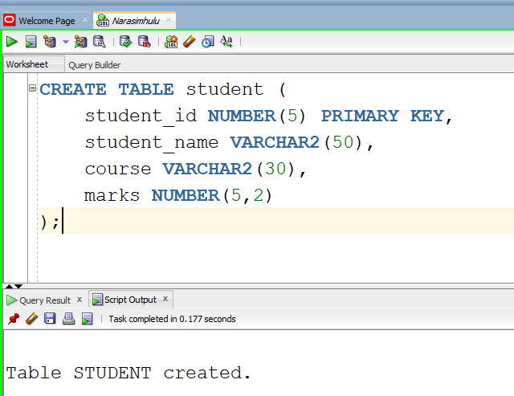

## Insertion of content in student table
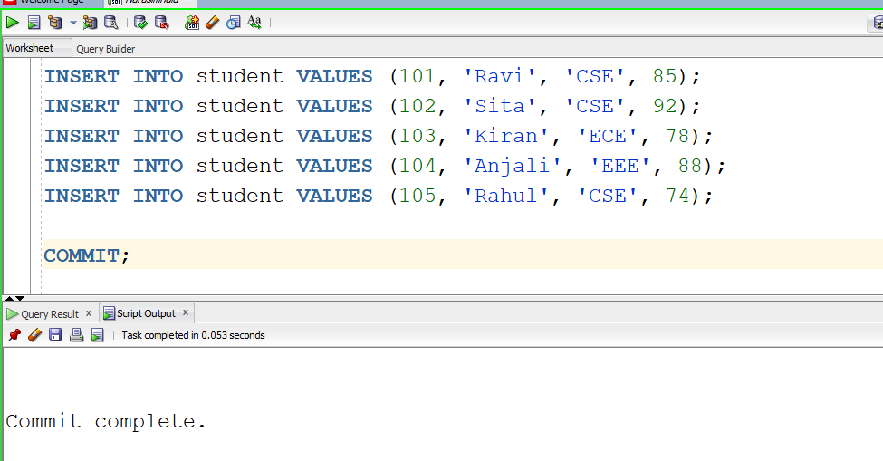

## verifying student table Information
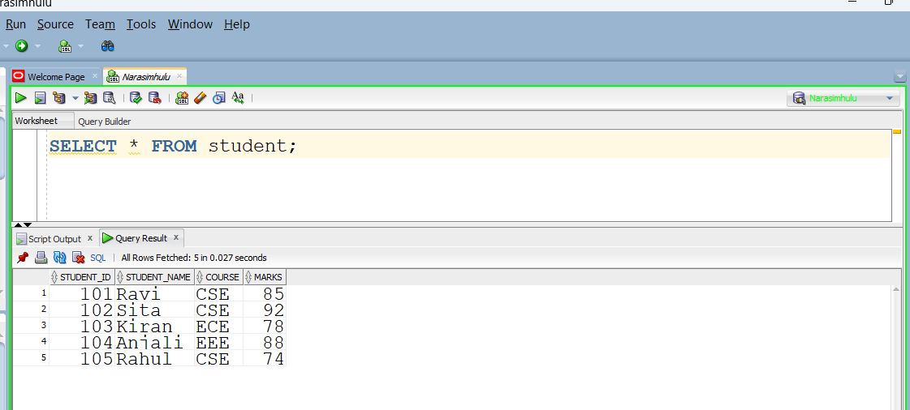

## 2. Create the Stored Procedure

```
CREATE OR REPLACE PROCEDURE GET_STUDENT_DETAILS (
    p_student_id   IN  student.student_id%TYPE,
    p_student_name OUT student.student_name%TYPE,
    p_marks        OUT student.marks%TYPE
)
IS
BEGIN
    -- Retrieve student details
    SELECT student_name, marks
    INTO p_student_name, p_marks
    FROM student
    WHERE student_id = p_student_id;

EXCEPTION
    WHEN NO_DATA_FOUND THEN
        p_student_name := NULL;
        p_marks := NULL;

        DBMS_OUTPUT.PUT_LINE(
            'No student found with ID: ' || p_student_id
        );

    WHEN OTHERS THEN
        DBMS_OUTPUT.PUT_LINE(
            'Error: ' || SQLERRM
        );
END;

```
## Output of Procedure Compiled

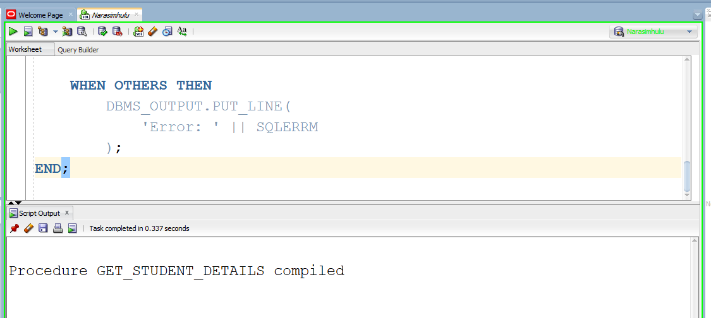

## Execution of procedure by creating Anonymous PL/SQL block

```
DECLARE
    -- Variables to receive OUT parameter values
    v_student_name student.student_name%TYPE;
    v_marks        student.marks%TYPE;

BEGIN
    -- Call the procedure
    GET_STUDENT_DETAILS(
        101,
        v_student_name,
        v_marks
    );

    -- Display returned values
    IF v_student_name IS NOT NULL THEN
        DBMS_OUTPUT.PUT_LINE(
            'Student Name : ' || v_student_name
        );

        DBMS_OUTPUT.PUT_LINE(
            'Marks        : ' || v_marks
        );
    END IF;

END;

```
## output by using correct student id
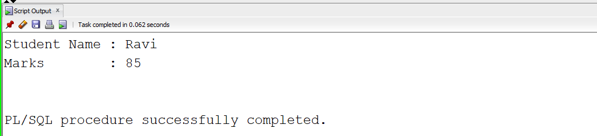

## Output by calling wrong student id

> **Note:** To execute it woring id put it to -101

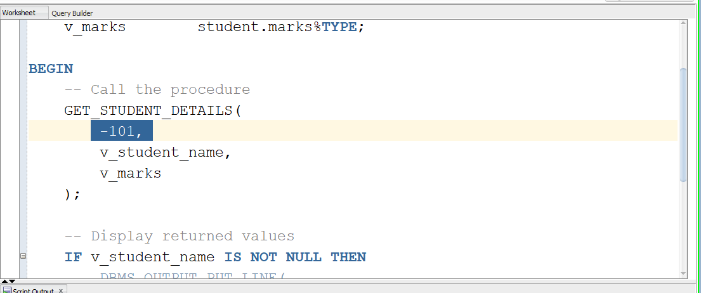
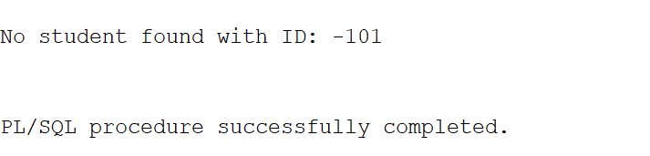

## Another Method of Execution

1. Enable Server output
2. Create two bind Variables
3. Call the Procudure using exec command
4. Print the two bind variables

### 1. Enable Server output

```

SET SERVEROUTPUT ON;

```
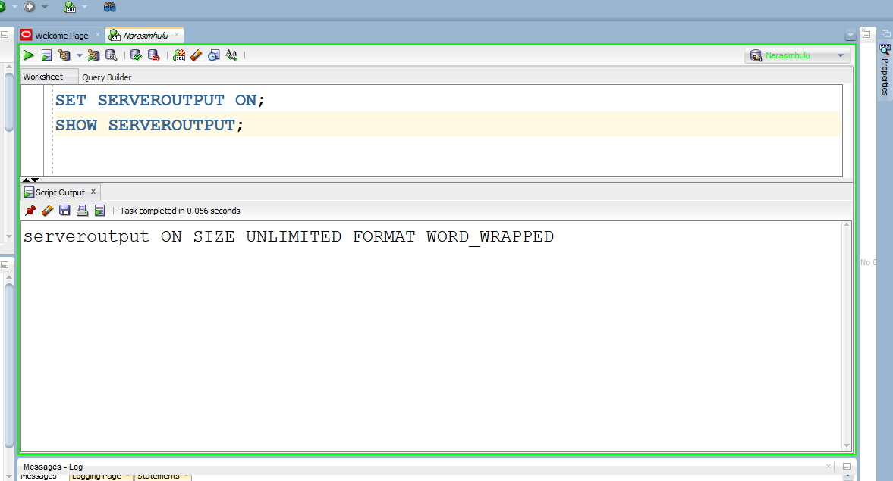

### 2. Create two bind variables

```
VARIABLE v_name VARCHAR2(50);
VARIABLE v_marks NUMBER;

```


### 3. Call the Procedure

```
EXEC GET_STUDENT_DETAILS(101, :v_name, :v_marks);

```
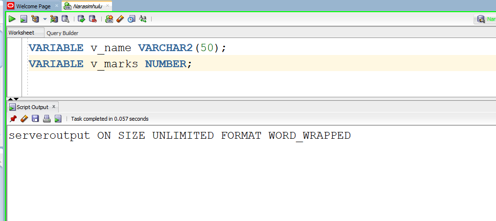

### 4. Print the two binded variables;

```
PRINT v_name;
PRINT v_marks;

```
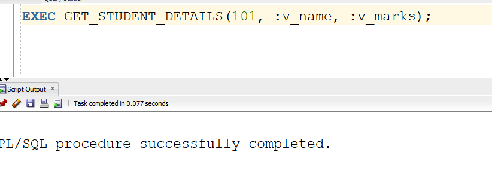

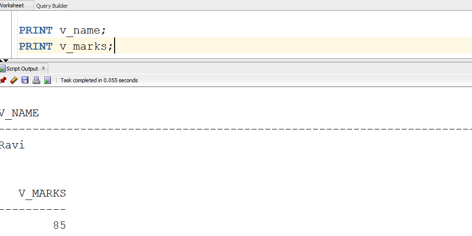

### Calling Procudure with wrong input

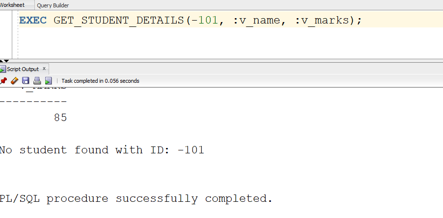

