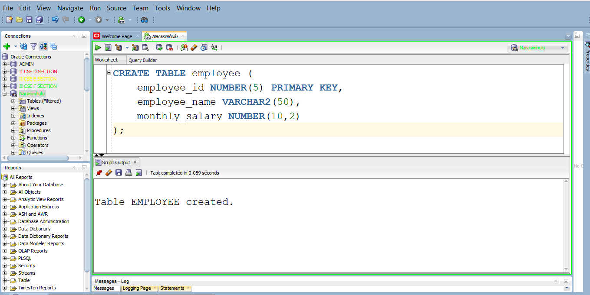
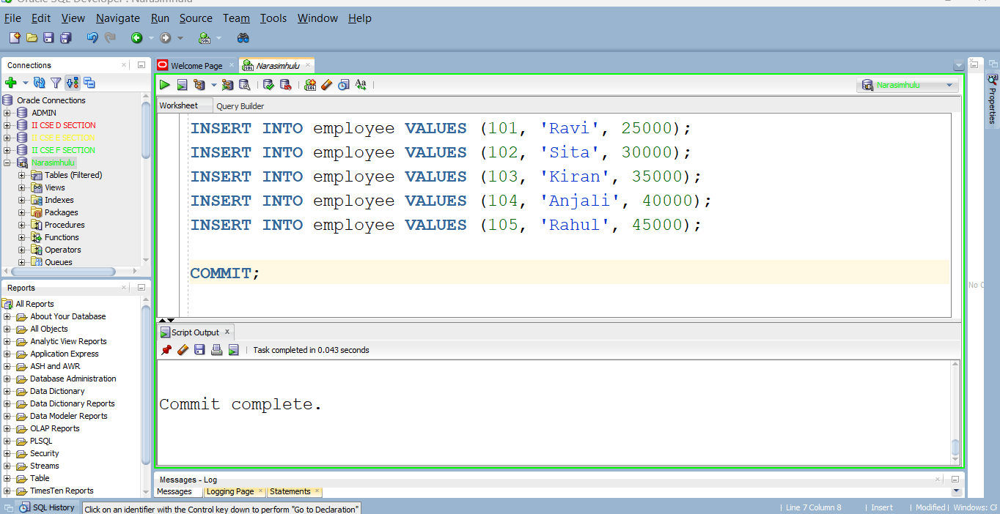
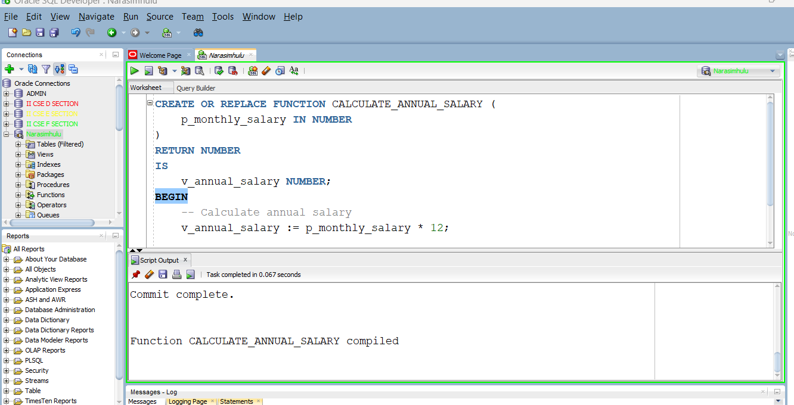
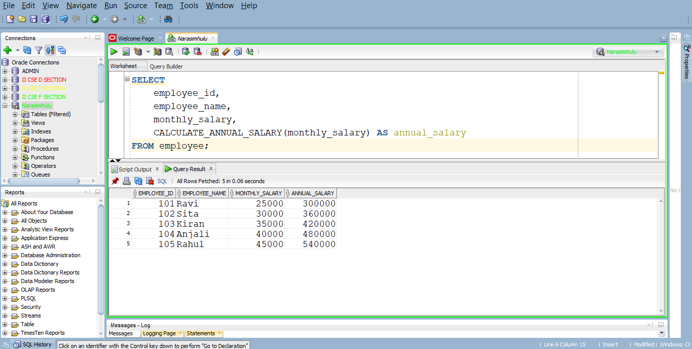
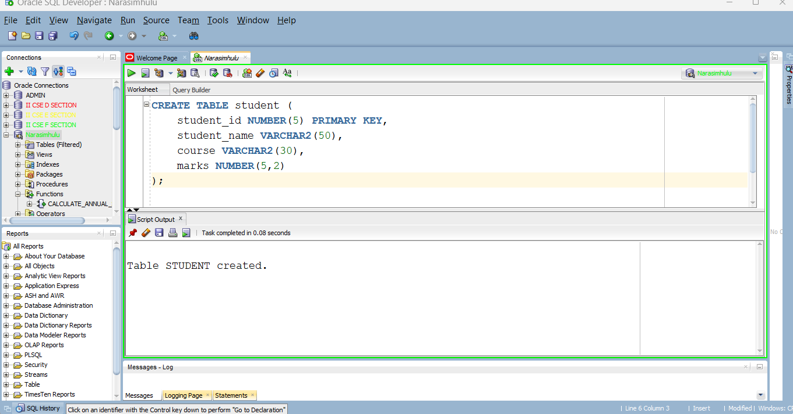

# Experiment - 7b

## Program 1: Calculate Annual Salary Using a Stored Function 

## 1. Create the Employee table

```
CREATE TABLE employee (
    employee_id NUMBER(5) PRIMARY KEY,
    employee_name VARCHAR2(50),
    monthly_salary NUMBER(10,2)
);

```
## Output of Employee table



## 2. Insert Sample Employee Records

```
INSERT INTO employee VALUES (101, 'Ravi', 25000);
INSERT INTO employee VALUES (102, 'Sita', 30000);
INSERT INTO employee VALUES (103, 'Kiran', 35000);
INSERT INTO employee VALUES (104, 'Anjali', 40000);
INSERT INTO employee VALUES (105, 'Rahul', 45000);

COMMIT;

```
## Output of Insertion Employee table



## 3. Create the Stored Function

```
CREATE OR REPLACE FUNCTION CALCULATE_ANNUAL_SALARY (
    p_monthly_salary IN NUMBER
)
RETURN NUMBER
IS
    v_annual_salary NUMBER;
BEGIN
    -- Calculate annual salary
    v_annual_salary := p_monthly_salary * 12;

    -- Return annual salary
    RETURN v_annual_salary;
END;

```
## Output of Compiled Function



## Execute the Function Using SELECT

```

SELECT
    employee_id,
    employee_name,
    monthly_salary,
    CALCULATE_ANNUAL_SALARY(monthly_salary) AS annual_salary
FROM employee;

```
## Output of Function using Select Statement



---

## Program 2: Find the Total Number of Students in a Course 

## 1. Create the STUDENT Table

```
CREATE TABLE student (
    student_id NUMBER(5) PRIMARY KEY,
    student_name VARCHAR2(50),
    course VARCHAR2(30),
    marks NUMBER(5,2)
);

```
## Output of Student table Creation




## 2. Insert Sample Student Records

```
INSERT INTO student VALUES (101, 'Ravi',   'CSE', 85);
INSERT INTO student VALUES (102, 'Sita',   'CSE', 92);
INSERT INTO student VALUES (103, 'Kiran',  'ECE', 78);
INSERT INTO student VALUES (104, 'Anjali', 'EEE', 88);
INSERT INTO student VALUES (105, 'Rahul',  'CSE', 74);
INSERT INTO student VALUES (106, 'Priya',  'ECE', 95);
INSERT INTO student VALUES (107, 'Arun',   'IT',  81);
INSERT INTO student VALUES (108, 'Sneha',  'CSE', 89);
INSERT INTO student VALUES (109, 'Vijay',  'EEE', 68);
INSERT INTO student VALUES (110, 'Divya',  'IT',  91);
INSERT INTO student VALUES (111, 'Manoj',  'ECE', 76);
INSERT INTO student VALUES (112, 'Kavya',  'CSE', 84);
INSERT INTO student VALUES (113, 'Ramesh', 'IT',  72);
INSERT INTO student VALUES (114, 'Swathi', 'EEE', 87);
INSERT INTO student VALUES (115, 'Ajay',   'ECE', 93);

COMMIT;

```

## 3. Create the Stored Function

```

CREATE OR REPLACE FUNCTION COUNT_STUDENTS (
    p_course IN VARCHAR2
)
RETURN NUMBER
IS
    v_total_students NUMBER;
BEGIN
    -- Count students belonging to the given course
    SELECT COUNT(*)
    INTO v_total_students
    FROM student
    WHERE course = p_course;

    -- Return the count
    RETURN v_total_students;
END;

```

## Invoke the Function Using SQL SELECT

```
SELECT
    'CSE' AS course,
    COUNT_STUDENTS('CSE') AS total_students
FROM dual;

```
## 5. Test Other Courses

```
SELECT
    'ECE' AS course,
    COUNT_STUDENTS('ECE') AS total_students
FROM dual;

```

## Display Count for All Courses

```

SELECT
    course,
    COUNT_STUDENTS(course) AS total_students
FROM (
    SELECT DISTINCT course
    FROM student
);

```
## Program 3: Determine Student Grade Using a Complex Stored Function 

## 1. Create the STUDENT Table

```

CREATE TABLE student (
    student_id NUMBER(5) PRIMARY KEY,
    student_name VARCHAR2(50),
    course VARCHAR2(30),
    marks NUMBER(5,2)
);

```
## 2. Insert Sample Student Records

```
INSERT INTO student VALUES (101, 'Ravi',   85);
INSERT INTO student VALUES (102, 'Sita',   72);
INSERT INTO student VALUES (103, 'Kiran',  55);
INSERT INTO student VALUES (104, 'Anjali', 45);
INSERT INTO student VALUES (105, 'Rahul',  30);
INSERT INTO student VALUES (106, 'Priya',  91);
INSERT INTO student VALUES (107, 'Arun',   68);
INSERT INTO student VALUES (108, 'Sneha',  58);

COMMIT;
```

## 3. Create the Stored Function GET_GRADE

```
CREATE OR REPLACE FUNCTION GET_GRADE (
    p_marks IN NUMBER
)
RETURN VARCHAR2
IS
    v_grade VARCHAR2(20);
BEGIN

    -- Determine grade based on marks
    IF p_marks >= 75 THEN
        v_grade := 'Distinction';

    ELSIF p_marks >= 60 THEN
        v_grade := 'First Class';

    ELSIF p_marks >= 50 THEN
        v_grade := 'Second Class';

    ELSIF p_marks >= 35 THEN
        v_grade := 'Pass';

    ELSE
        v_grade := 'Fail';
    END IF;

    -- Return the calculated grade
    RETURN v_grade;

END;
/

```

## 4. Invoke the Function Using SELECT 

```
SELECT
    student_name,
    marks,
    GET_GRADE(marks) AS grade
FROM student;

```


 
